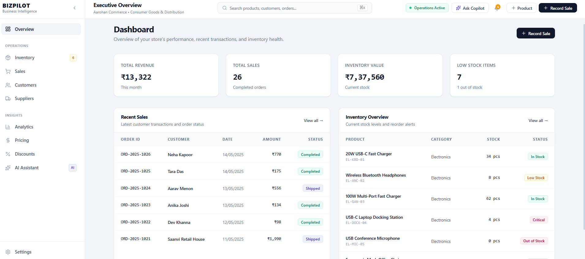
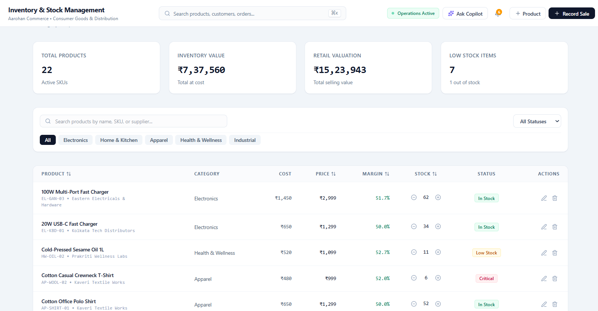
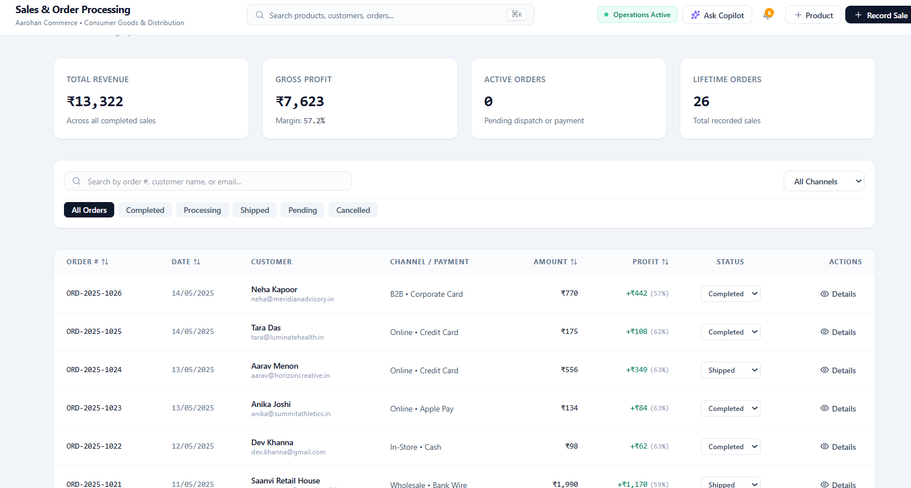
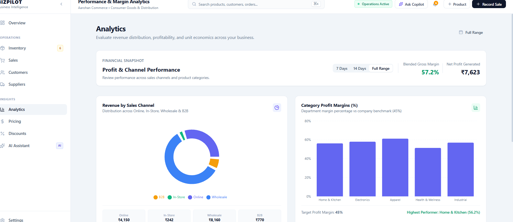
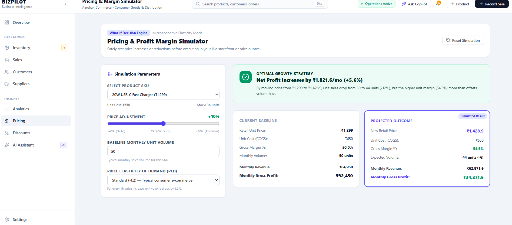
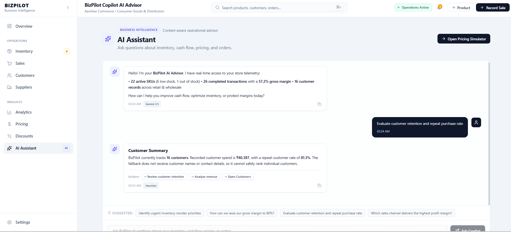
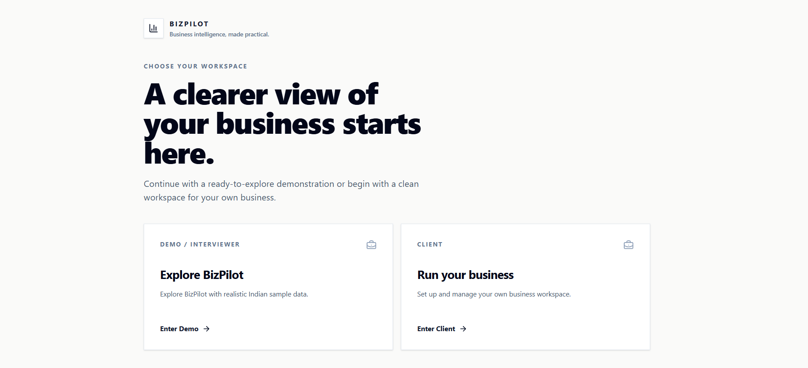

# BizNet

## Business Intelligence & Operations Platform

A full-stack React + TypeScript + Express business operations and intelligence portfolio application.

BizNet brings sales, inventory, customers, suppliers, purchase orders, analytics, pricing experiments, discount analysis, and an AI Assistant into one focused workspace.

[Live Demo](https://biznet-nine.vercel.app/)

## 🚀 Live Demo

**[Try BizNet Live](https://biznet-nine.vercel.app/)**

BizNet is deployed as a portfolio/demo application. Demo and Client workspaces use browser-local persistence; production authentication, database persistence, and multi-user tenancy are intentionally outside the current scope.

## Repository

This repository contains the BizNet application source, technical documentation, tests, and deployment-ready configuration.

## 📸 Screenshots

### Dashboard



### Inventory



### Sales



### Analytics



### Pricing



### AI Assistant



### Workspace Selection



The included Demo workspace uses fictional Indian-market sample data and INR pricing. The Client workspace starts independently so the local application can be explored with a clean business dataset.

## Why It Was Built

Small and medium businesses often manage sales, stock, purchasing, and customer information across disconnected tools. BizNet explores what a single operational view could look like: current performance is visible alongside the actions needed to protect stock availability, margins, and cash flow.

## Key Features

- **Dashboard:** revenue, profit, margin, order, inventory, and stock-health summaries.
- **Sales:** create orders, track status, update customer totals, deduct inventory, and cancel orders with stock restoration.
- **Inventory:** add, edit, delete, search, filter, and adjust stock for products.
- **Customers:** manage customer records, tiers, order history metrics, and lifetime spend.
- **Suppliers:** manage supplier records and supplier performance details.
- **Purchase orders:** create purchase orders and receive stock exactly once when an order is marked received.
- **Analytics:** review revenue, cost, profit, margin, category performance, and date-filtered trends.
- **Pricing:** model price changes against estimated volume and margin outcomes.
- **Discount optimization:** evaluate promotion scenarios and their effect on contribution and break-even volume.
- **AI Assistant:** ask business questions using privacy-conscious aggregate and product-level business context.
- **Workspace separation:** switch between Demo and Client datasets with separate browser storage namespaces.
- **Indian localization:** INR demo settings, Indian number/date/phone formatting, Indian fictional names, businesses, locations, and products.
- **Operational utilities:** notifications, global search, data export/import, and local reset controls.

## Demo and Client Workspaces

The `/login` entry screen is a simulated workspace selector, not an authentication system.

- **Demo:** loads the populated fictional Indian SMB dataset.
- **Client:** loads an independent empty workspace that can be populated through the existing application workflows.

Business collections are persisted separately in browser localStorage keys such as `bizpilot:demo:products:v1` and `bizpilot:client:products:v1`. The current implementation provides local workspace isolation, not authenticated users, backend accounts, or production multi-tenancy. Existing legacy unscoped `bizpilot` data is treated as Demo data. A versioned Demo seed migration refreshes recognized stale Western sample data without modifying Client storage.

## Architecture Overview

The browser runs the React application and owns business state through `BusinessContext`. The Express/Node.js server hosts the Vite development middleware or production static assets and exposes the AI endpoint. Business data is currently local to the browser; there is no production database.

See [docs/architecture.md](docs/architecture.md) for the current data flow and a possible production evolution.

## Deployment

BizNet is deployed on Vercel.

Live: [https://biznet-nine.vercel.app/](https://biznet-nine.vercel.app/)

The deployment uses the existing Express backend/API and Vercel deployment configuration implemented in this repository.

## Technology Stack

- React 19
- TypeScript
- Vite
- Express and Node.js
- React Router
- Tailwind CSS
- Lucide React
- Recharts
- Google Gemini through `@google/genai`
- Vitest, Testing Library, and jsdom

This is not a MERN application: the current project does not use MongoDB.

## AI Architecture

1. `AiAdvisorView` builds a request from the active workspace's business metrics and product metrics.
2. It sends `POST /api/ai/advisor` to the Express server with the query, recent conversation history, and business context.
3. The server keeps `GEMINI_API_KEY` private and, when configured, calls Gemini `gemini-2.5-flash` with a structured operating-advisor instruction.
4. The server returns the model response and suggested actions, or uses `generateFallbackResponse` when Gemini is unavailable or fails.
5. The frontend also has a local fallback for a network-level request failure.

The supplied context includes aggregate revenue, profit, margins, product inventory and pricing metrics, stock alerts, order counts, customer aggregates, supplier counts, and purchase-order aggregates. Direct customer contact details are not sent to the server. The endpoint validates non-empty queries, limits queries to 2,000 characters, limits JSON request bodies to 64 KB, and applies a limit of 20 requests per minute per IP.

## Security Considerations

- The Gemini API key is read server-side from `GEMINI_API_KEY`; it is not placed in frontend code.
- The AI endpoint has request-size, query-length, and rate-limit boundaries.
- AI context intentionally uses aggregate business information and product metrics rather than customer contact details.
- Business data is persisted in browser localStorage, which is suitable for this simulation but not a secure production data store.
- Authentication, authorization, backend accounts, JWT, OAuth, encrypted persistence, and production tenant isolation are not implemented.

## Testing

The repository uses Vitest with jsdom and Testing Library. Tests cover formatting, analytics filtering, order cancellation, purchase-order inventory behavior, AI endpoint contracts, AI fallback behavior, workspace isolation, and workspace entry behavior.

Run the verified commands:

```bash
npm test
npm run lint
npm run build
```

## Local Setup

### Prerequisites

- Node.js 18 or later
- npm

### Install and run

```bash
npm install
npm run dev
```

The development server runs on port `3000` and serves the application through Express and Vite middleware.

For a production-style local run:

```bash
npm run build
npm start
```

## Environment Variables

Copy `.env.example` to `.env` or provide the variable through the shell environment:

```env
GEMINI_API_KEY=your_gemini_api_key
```

The key is optional for core dashboard workflows. Without it, the AI endpoint uses the deterministic fallback response path.

## Current Limitations

- Data is stored in one browser's localStorage and is not synchronized across devices.
- The workspace selector is simulated; there is no authentication or account management.
- There is no database, backend business-data API, or production multi-tenant authorization layer.
- AI quality depends on Gemini availability and configuration; the deterministic fallback is intentionally bounded.
- The application has no automated end-to-end browser suite or deployment pipeline in this repository.

## Future Production Evolution

A production version could introduce authenticated users, server-owned workspace membership, a database-backed business-data API, role-based authorization, encrypted secrets and persistence, audit logs, observability, and deployment-specific scaling. Those are future architecture considerations, not current BizNet functionality.

## Project Structure

```text
src/
  components/   Feature views, modals, layout, and shared UI
  context/      Business state, mutations, metrics, and workspace persistence
  data/         Fictional Indian Demo seed data
  utils/        Formatters and deterministic AI fallback
  __tests__/    Unit and component tests
server.ts       Express server, health check, AI endpoint, and Vite/static hosting
docs/           Technical documentation
screenshots/    Manually captured application views
```
