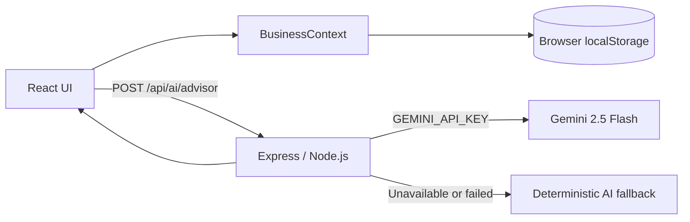
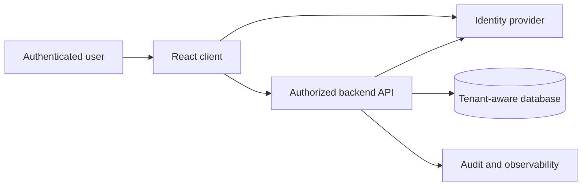

# BizNet Architecture

## Current Implementation

BizNet is a React and TypeScript single-page application served by an Express/Node.js process. Vite provides development middleware and builds the frontend assets. In production mode, Express serves the generated `dist` directory and provides the SPA fallback route.

### Frontend

- `src/App.tsx` provides the browser router, workspace entry route, shared shell, lazy-loaded views, and global modals/drawers.
- `src/context/BusinessContext.tsx` owns products, customers, orders, suppliers, purchase orders, settings, mutations, computed metrics, and local persistence.
- Workspace IDs are currently `demo` and `client`. Each collection is stored independently, for example `bizpilot:demo:products:v1`.
- `src/data/initialData.ts` contains fictional Indian Demo data. The Client workspace starts with empty operational collections and uses the same existing workflows to create data.
- Shared formatters provide Indian currency, date, and phone presentation where used by the UI.

### Server

`server.ts` creates the Express application, loads environment variables with `dotenv`, applies a 64 KB JSON body limit, exposes `/api/health`, and exposes `POST /api/ai/advisor`. In development it attaches Vite middleware; in production it serves static assets from `dist`.

### AI Request Flow

`AiAdvisorView` sends the active workspace's aggregate business metrics, product metrics, and a limited conversation history to the Express endpoint. The server calls Gemini `gemini-2.5-flash` only when `GEMINI_API_KEY` is available. The key remains server-side. If Gemini is unavailable or throws, the server calls the deterministic `generateFallbackResponse` utility. A separate client-side fallback handles a network-level request failure.

The endpoint accepts non-empty queries up to 2,000 characters, limits request bodies to 64 KB, and applies an in-memory rate limit of 20 requests per minute per IP. The server's context contract is privacy-conscious: it includes aggregate customer metrics rather than customer names, email addresses, or phone numbers.

### Persistence and Isolation

The current persistence boundary is browser localStorage. On startup, Demo data loads from its scoped keys, or from the Indian seed when no current snapshot exists. Legacy unscoped `bizpilot` keys are interpreted as Demo data. A Demo seed revision check refreshes recognized stale Western sample snapshots without touching Client keys. This is local data separation for a portfolio simulation, not production tenant security.

## Potential Production Evolution

The local persistence boundary could later be replaced without changing the view-level business workflows:

That future design would require real authentication, authorization, server-side workspace membership, tenant-scoped queries, database migrations, encrypted secret management, audit logging, and operational monitoring. None of those production services are implemented in the current repository.
